University: [ITMO University](https://itmo.ru/ru/)  
Faculty: [FICT](https://fict.itmo.ru)  
Course: [IP-telephony](https://github.com/itmo-ict-faculty/ip-telephony)

Year: 2025  
Group: K34202  
Author: Subbota Anton  
Lab: Lab2 
Date of create: 10.05.2025  
Date of finished: 10.05.2025 

## Лабораторная работа №1 "Базовая настройка ip-телефонов в среде Сisco packet tracer"

### Описание
Для выполнения данной лабораторной работы собирается схема соединения. Необходимо проверить, правильно ли подключены и настроены все узлы устройств.

### Цель работы
Изучить рабочую среду Cisco Packet Tracer, ознакомить- ся с интерфейсами основных устройств, типами кабелей, научиться собирать топологию. Изучить построение сети IP-телефонии с помощью маршрутизатора, коммутатора и IP телефонов Cisco 7960 в среде Packet tracer

### Ход работы 

#### Часть 1

1. Построим сеть

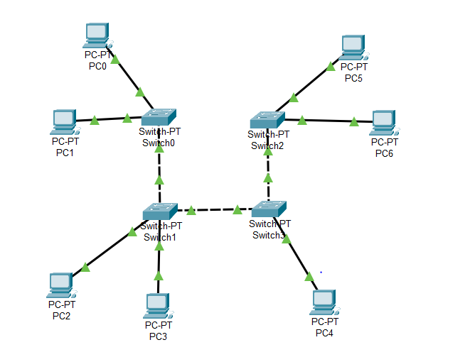

2. Раздадим IP статикой

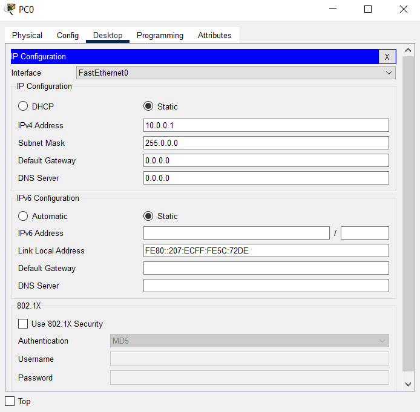

3. Проверим работоспособность сети и убедимся что сеть работает исправно

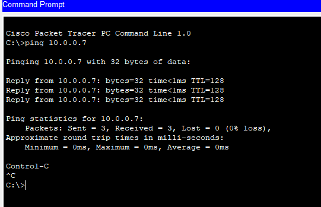

#### Часть 2

1. Построим схему 

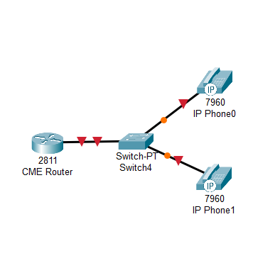

2. Укажем Hostname

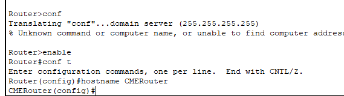

3. Настроим интерфейс 

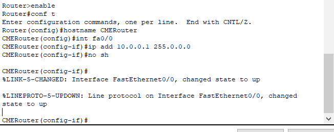

4. Настроим DHCP. option 150 - нужно для включения TFTP

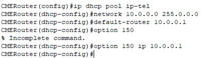

5. Настроим услуги телефонии на маршрутизаторе

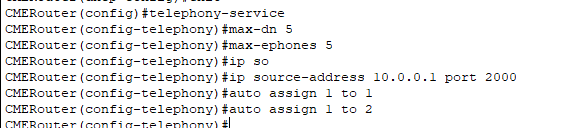

6. Зададим номера 

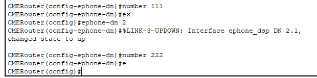

7. Не забудим подключить питание

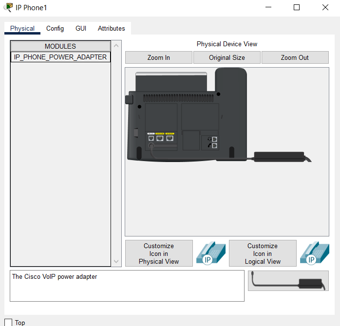

8. Попробуем позвонить и убедимся что вызов отлично идет

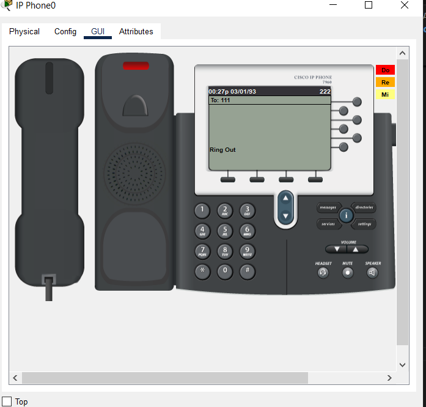

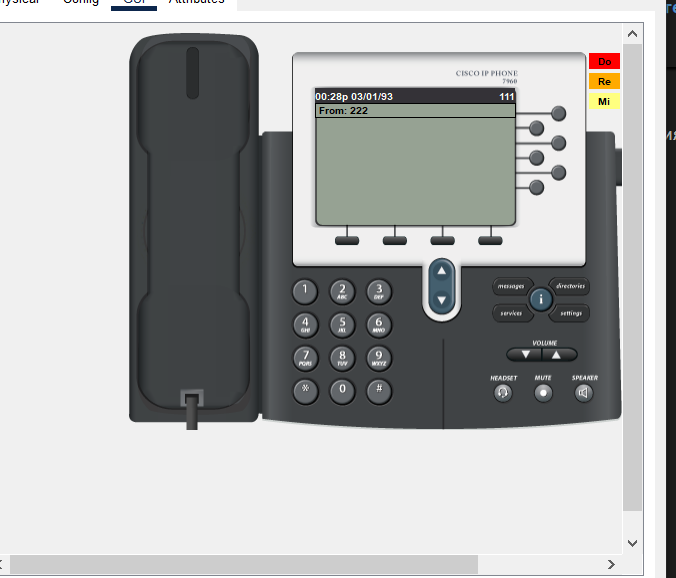