University: [ITMO University](https://itmo.ru/ru/)  
Faculty: [FICT](https://fict.itmo.ru)  
Course: [IP-telephony](https://github.com/itmo-ict-faculty/ip-telephony)

Year: 2025  
Group: K34202  
Author: Subbota Anton
Lab: Lab1  
Date of create: 10.05.2025  
Date of finished: 10.05.2025 

## Лабораторная работа №2 "Конфигурация voip в среде Сisco packet tracer"

### Описание
Для выполнения данной лабораторной работы собирается схема соединения. Необходимо проверить, правильно ли подключены все узлы устройств. Предварительно удалить все предыдущие конфигурационные файлы на маршрутизаторах Cisco 2811, на коммутаторе Cisco catalyst 3560.

### Цель работы
Иизучить построение сети IP-телефонии с помощью маршрутизатора Cisco 2811, коммутатора Cisco catalyst 3560 и IP телефонов Cisco 7960.

### Ход работы 

#### Часть 1

1. Построим сеть 
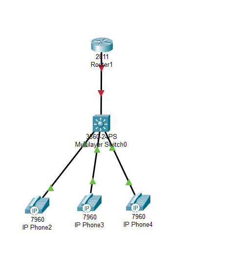

2. Сменим название

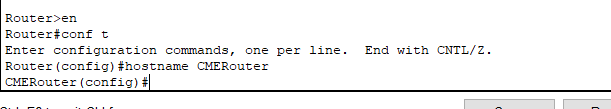

3. Зададим пароли 

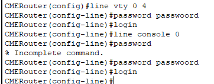

4. Настроим интерфейс

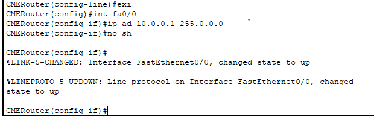

5. Настроим DHCP аналогично первой лабораторной работе

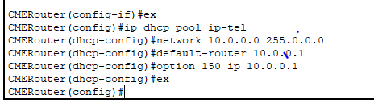

6. Настроим услуги телефонии на маршрутизаторе аналогично первой лабораторной работе

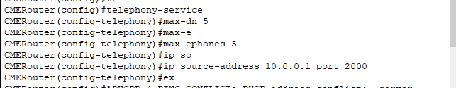

7. Настроим порты на коммутаторе

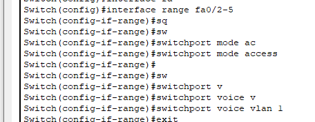

8. Создадим номера аналогично первой команде

9. Позвоним 

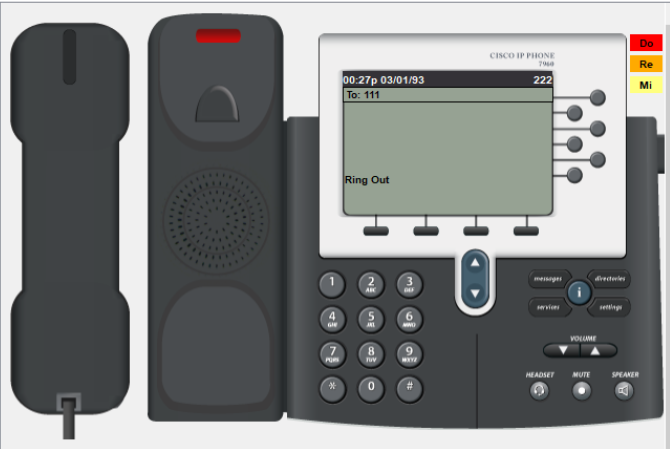

#### Часть 2

1. Построим сеть 

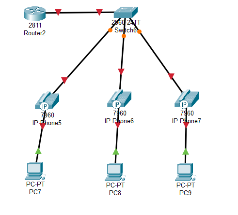

2. Настроим dchp на роутере и подынтерфейсы

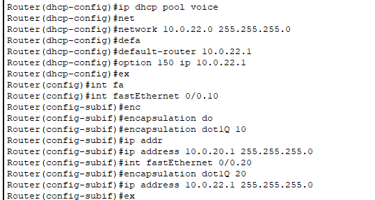

3. Настроим порты на коммутаторе. (порт к маршрутизатору транк)

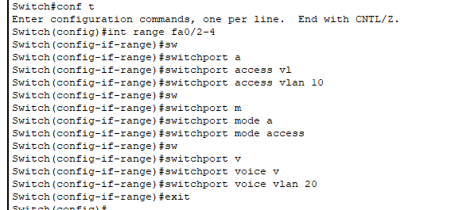

4. Проверим связность 

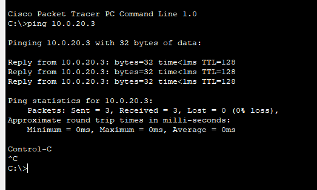

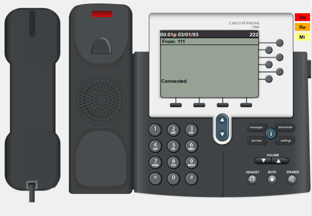

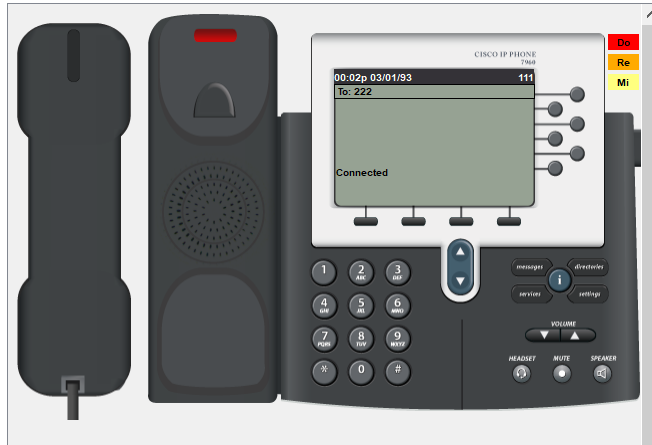

